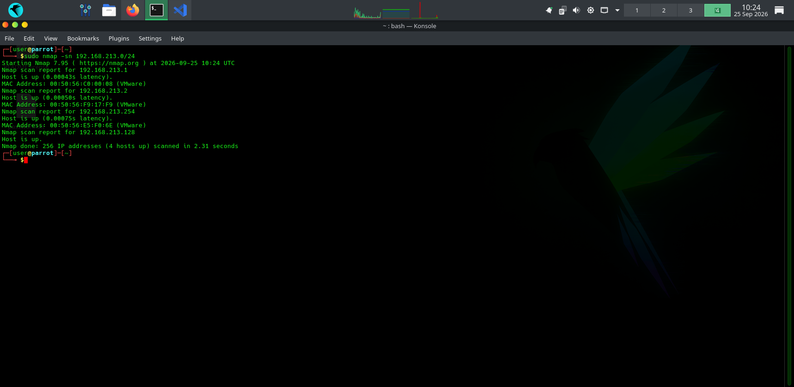
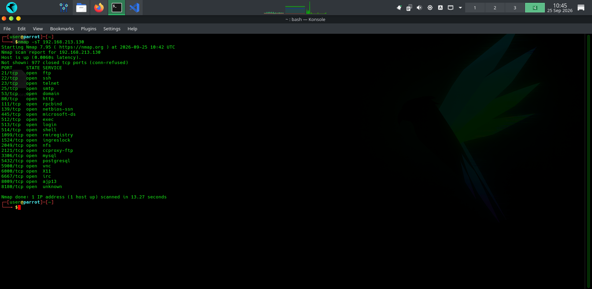
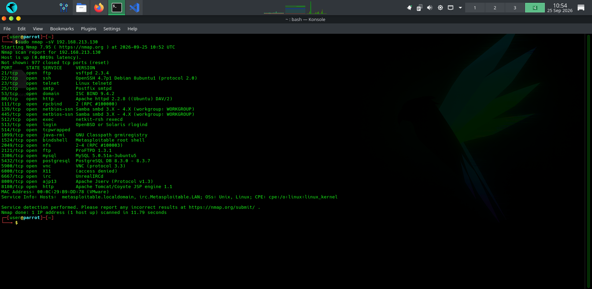
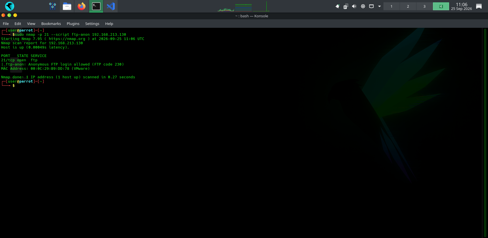
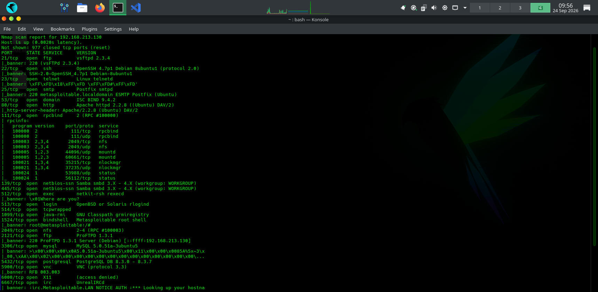
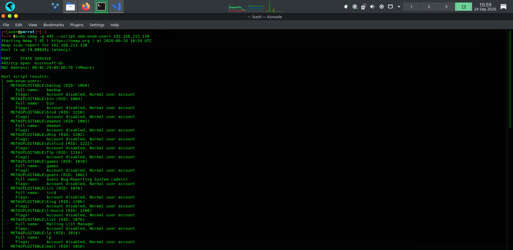
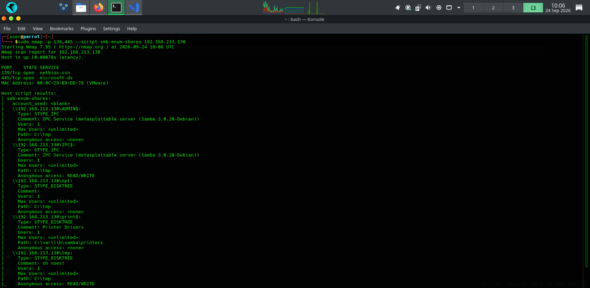

# Reconnaissance & Enumeration Report

Project: Metasploitable 2 Reconnaissance Assessment

Target System: `192.168.213.130`

Platform: Metasploitable 2 (VMware Lab)

Assessor: `Omoregbe Francis`

Assessment Date: `23–25 September 2026`

Tools Used: Nmap 7.95

# 1. Executive Summary

A reconnaissance and enumeration assessment was performed against the Metasploitable 2 virtual machine within an isolated VMware laboratory. The objective was to identify live hosts, discover exposed network services, enumerate accessible resources, and gather information that could support a later vulnerability assessment.

The assessment identified one live host on the subnet (`192.168.213.130`) with numerous exposed services, including FTP, SSH, Telnet, HTTP, SMB, MySQL, PostgreSQL, and Samba. Additional enumeration using the Nmap Scripting Engine (NSE) revealed anonymous FTP access, accessible SMB shares, and service banners that exposed software versions.

This phase focused only on information gathering and service enumeration. No persistence or unauthorized modification of the target was performed.

## Findings Summary

|
Category

|

Result

|
| --- | --- |
|

Live hosts discovered

|

1

|
|

Open TCP ports

|

23

|
|

Services identified

|

FTP, SSH, Telnet, SMTP, HTTP, SMB, MySQL, PostgreSQL, VNC, IRC

|
|

SMB shares enumerated

|

Yes

|
|

Anonymous FTP access

|

Yes

|
|

Service banners collected

|

Yes

|

# 2. Assessment Scope

## Objective

The purpose of this assessment was to perform a complete reconnaissance and enumeration sweep of the target machine by:

* Discovering live hosts on the subnet

* Identifying open ports

* Detecting running services

* Enumerating SMB shares and users where possible

* Checking anonymous FTP access

* Collecting service banners

## Target Information

|
Item

|

Value

|
| --- | --- |
|

IP Address

|

`192.168.213.130`

|
|

Operating System

|

Metasploitable 2 (Linux)

|
|

Network

|

`192.168.213.0/24`

|
|

Environment

|

VMware Internal Lab

|

# 3. Methodology

The assessment followed four stages:

1. Host Discovery – Identify active hosts on the subnet.

2. Port Scanning – Discover exposed TCP ports.

3. Service Enumeration – Identify services and software versions.

4. NSE Enumeration – Gather additional information from FTP and SMB services.

# 4. Host Discovery

### Command

Bash

```
sudo nmap -sn 192.168.213.0/24
```

### Purpose

This scan identifies which devices are alive without scanning their ports.

### Result

|
Host

|

Status

|
| --- | --- |
|

192.168.213.130

|

Live

|

Observation: 4 active target was identified during the assessment.



# 5. Port & Service Scanning

## 5.1 SYN Scan

### Command

Bash

```
sudo nmap -sS 192.168.213.130
```

### Description

The SYN scan sends a TCP SYN packet to determine whether a port is open. It identifies open ports without completing the full TCP connection.

Best used for:

* Fast reconnaissance

* Initial port discovery

* Internal network assessments

![]

## 5.2 TCP Connect Scan

### Command

Bash

```
nmap -sT 192.168.213.130
```

### Description

A TCP Connect scan performs the complete TCP three-way handshake using the operating system's networking stack.

Best used for:

* Systems where root privileges are unavailable

* Verifying that services accept full TCP connections

* Troubleshooting connectivity



## 5.3 Version Detection Scan

### Command

Bash

```
sudo nmap -sV 192.168.213.130
```

### Description

Version detection identifies the software and version running on open ports by sending service-specific probes.

Best used for:

* Service identification

* Vulnerability assessment

* Software inventory



## Difference Between the Scans

|
Scan

|

Purpose

|

Connection

|
| --- | --- | --- |
|

SYN (`-sS`)

|

Find open ports

|

Partial

|
|

Connect (`-sT`)

|

Verify TCP connectivity

|

Full

|
|

Version (`-sV`)

|

Identify services and versions

|

Service probing

|

# 6. Open Ports Discovered

|
Port

|

Service

|

Version

|
| --- | --- | --- |
|

21

|

FTP

|

vsftpd 2.3.4

|
|

22

|

SSH

|

OpenSSH 4.7

|
|

23

|

Telnet

|

Linux telnetd

|
|

25

|

SMTP

|

Postfix

|
|

53

|

DNS

|

ISC BIND 9.4.2

|
|

80

|

HTTP

|

Apache 2.2.8

|
|

139

|

SMB

|

Samba

|
|

445

|

SMB

|

Samba 3.0.20

|
|

3306

|

MySQL

|

5.0.51

|
|

5432

|

PostgreSQL

|

8.3

|
|

5900

|

VNC

|

Protocol 3.3

|
|

6667

|

IRC

|

UnrealIRCd

|

Observation: Multiple legacy services were exposed, increasing the attack surface of the target.

# 7. Service Enumeration Using NSE

## 7.1 Anonymous FTP Enumeration

### Command

Bash

```
sudo nmap -p 21 --script ftp-anon 192.168.213.130
```

### Result

* Anonymous login was permitted.

* The FTP service allowed guest access without authentication.

Risk: Unauthorized users may browse or download files exposed through the FTP server.



## 7.2 SMB Share Enumeration

### Command

Bash

```
sudo nmap -p 139,445 --script smb-enum-shares 192.168.213.130
```

### Result

SMB enumeration identified accessible network shares, including administrative and public shares.

Information gathered included:

* Share names

* Guest accessibility

* Available SMB resources

## 7.3 Banner Grabbing

### Command

Bash

```
sudo nmap -sV --script banner 192.168.213.130
```

### Result

Service banners revealed software versions such as:

|
Service

|

Banner Information

|
| --- | --- |
|

FTP

|

vsftpd 2.3.4

|
|

SSH

|

OpenSSH 4.7

|
|

HTTP

|

Apache 2.2.8

|
|

MySQL

|

MySQL 5.0.51

|

Purpose: Banner grabbing helps identify outdated software that may contain known vulnerabilities.



# 8. User & Share Enumeration

## SMB User Enumeration

### Command

Bash

```
sudo nmap -p 445 --script smb-enum-users 192.168.213.130
```

### Result

The scan attempted to enumerate user accounts exposed through SMB. Enumeration was performed where permissions allowed.



## SMB Shares

### Command

Bash

```
sudo nmap -p 139,445 --script smb-enum-shares 192.168.213.130
```

### Information Collected

* Public shares

* Administrative shares

* IPC communication share

* Guest accessibility



# 9. Key Reconnaissance Findings

|
Finding

|

Status

|
| --- | --- |
|

Live host discovered

|

Yes

|
|

23 TCP ports open

|

Yes

|
|

Anonymous FTP enabled

|

Yes

|
|

SMB shares exposed

|

Yes

|
|

Service banners obtained

|

Yes

|
|

Legacy software identified

|

Yes

|

# 10. Conclusion

The reconnaissance and enumeration phase successfully identified the target host and mapped its exposed network services. The assessment revealed a broad attack surface consisting of legacy services, publicly accessible resources, and software versions suitable for further security testing.

The information collected during this phase provides the foundation for the next stage of the assessment: vulnerability validation and exploitation testing within the authorized laboratory environment.

# Appendix A – Commands Used

## Host Discovery

Bash

```
sudo nmap -sn 192.168.213.0/24
```

## SYN Scan

Bash

```
sudo nmap -sS 192.168.213.130
```

## TCP Connect Scan

Bash

```
nmap -sT 192.168.213.130
```

## Version Detection

Bash

```
sudo nmap -sV 192.168.213.130
```

## SMB Share Enumeration

Bash

```
sudo nmap -p 139,445 --script smb-enum-shares 192.168.213.130
```

## SMB User Enumeration

Bash

```
sudo nmap -p 445 --script smb-enum-users 192.168.213.130
```

## Anonymous FTP Enumeration

Bash

```
sudo nmap -p 21 --script ftp-anon 192.168.213.130
```

## Banner Grabbing

Bash

```
sudo nmap -sV --script banner 192.168.213.130
```

